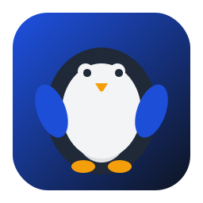

# Waddle

Native desktop shell for CLI-based AI agents. Connects to `codex` and `qwen` directly from the interface, without opening a terminal.

Built with **Python + PySide6 + QML**.



---

## Installation

### 1. Install as a native app (recommended)

```bash
./scripts/install_native_app.sh
```

This creates:
- Launcher at `~/.local/bin/waddle`
- Application menu entry (`.desktop`)
- Icons in multiple resolutions

Then open it from the app menu or run:

```bash
waddle
```

### 2. Run directly from the project (dev)

```bash
python3 -m venv .venv
source .venv/bin/activate
pip install -r requirements.txt

PYTHONPATH=src python -m cli_harness.native_app
```

---

## Configuration

Waddle reads settings from the `.env` file in the project root.

### Workspace (vault)

The working directory used by `codex` and `qwen` during sessions. Default: `~/Documents/vault-faux`.

```bash
# Edit .env directly:
echo 'OBSIDIAN_VAULT_PATH=/your/directory' >> .env
```

### CLI commands (optional)

If you want custom flags or a different executable path:

```bash
echo 'CODEX_CMD=codex --model gpt-4.1' >> .env
echo 'QWEN_CMD=qwen --model coder-plus' >> .env
```

### Display name (optional)

```bash
echo 'OSAURUS_NAME=Your Name' >> .env
```

---

## How to use

1. Open the app
2. In the composer, choose the backend (**Codex** or **Qwen**)
3. Click **Connect** — the CLI starts in a persistent session
4. Type your prompt and press **Enter** (or click **Send**)
5. To end the session, click **Stop**

### Quick commands

| Button | Action |
|-------|------|
| `/model` | Lists or switches the active model in the CLI |
| `/reset` | Resets conversation context |
| **Reconnect** | Reconnects to the CLI (highlighted when a session drops) |

---

## Requirements

- Python 3.9+
- PySide6 >= 6.7
- Linux desktop environment (GNOME, KDE, XFCE, etc.)
- `codex` or `qwen` installed and available in `PATH` (required for AI features)

### Install Codex CLI

```bash
npm install -g @openai/codex
```

### Install Qwen Code CLI

```bash
npm install -g qwen-code
```

---

## Uninstall

```bash
./scripts/uninstall_native_app.sh
```

---

## Project structure

```
src/cli_harness/
├── native_app.py         # App entry point
├── native_controller.py  # Controller: state, PTY, messages
├── config.py             # .env read/write
├── history.py            # SQLite session history
├── history_cli.py        # CLI to inspect history
├── backend_commands.py   # Backend command resolution
└── qml/
    └── Main.qml          # Graphical interface

assets/                   # App icons and mascot
scripts/                  # Install and publish scripts
```

---

## Session history

All sessions and messages are automatically saved to:

```
~/.local/share/cli_harness/history.db
```

To inspect via terminal:

```bash
# List sessions
PYTHONPATH=src python -m cli_harness.history_cli list-sessions

# List events for a session
PYTHONPATH=src python -m cli_harness.history_cli list-events --session-id 1
```
