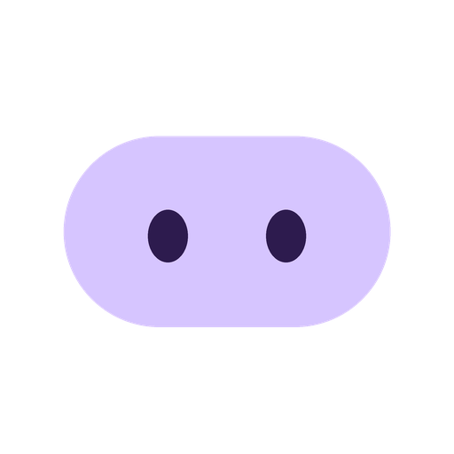
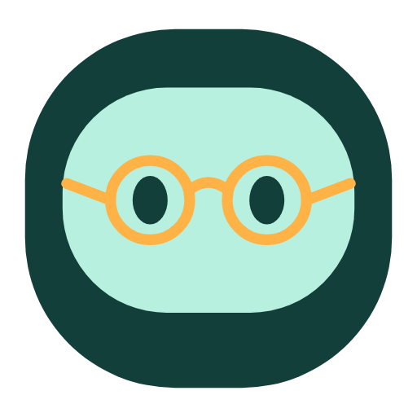
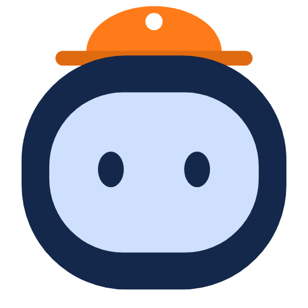
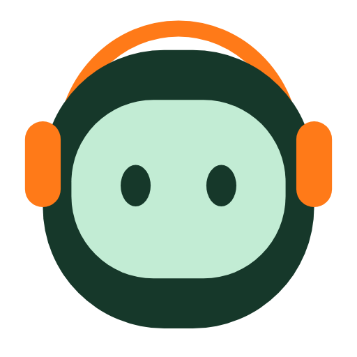
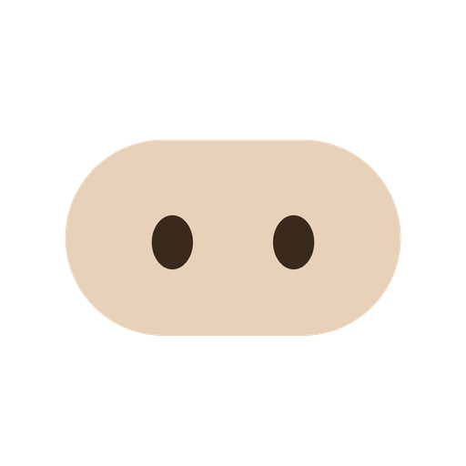
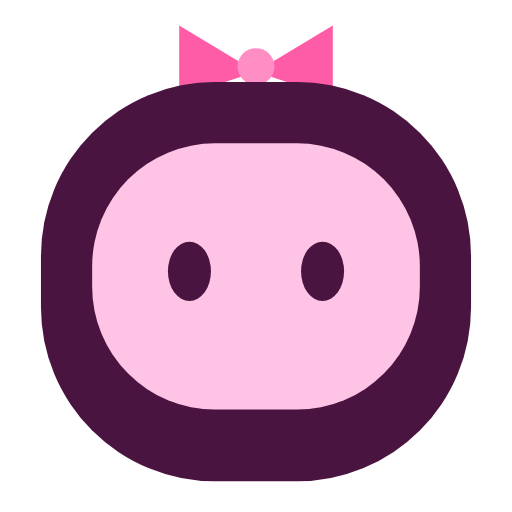
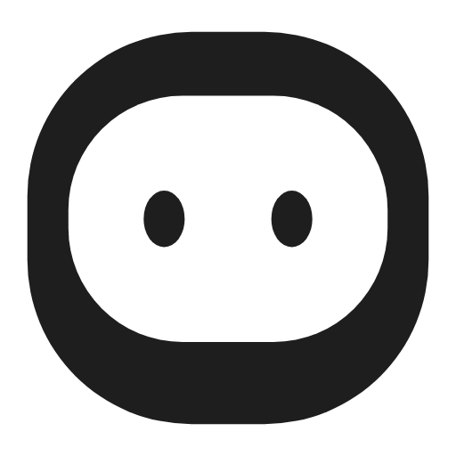

# Waddle Agent OS

<p align="center">
  
  
  
  
  
  
</p>

<p align="center">
  <strong>Ecossistema Multiagente com Mascotes Especialistas e Interface Visual Local</strong>
</p>

**Waddle Agent OS** é uma plataforma local para coordenar agentes de IA em uma interface visual. O projeto combina um frontend web em React, uma API em FastAPI, persistência em SQLite e motores locais/CLI como Ollama, Codex e Claude Code.

O objetivo é oferecer uma experiência parecida com um painel de trabalho multiagente: a Quinta coordena a conversa, agentes especialistas contribuem com opiniões ou tarefas, e o usuário acompanha tudo pela interface.

---

## Principais recursos

| Área | Status | Descrição |
| --- | --- | --- |
| Interface visual | [OK] | UI web moderna inspirada em workspaces modernos (canais de squad, chats diretos, upload de arquivos). |
| Multiagentes & Squads | [OK] | Quinta coordena Atlas, Nero, Iris, Ma e Livro em rodadas de discussão ou comandos individuais. |
| Agent Studio | [OK] | Customização visual (cores, cosméticos, fotos), alma/personalidade, skills, ferramentas e memória. |
| Perfil de Usuário | [OK] | Perfil humano dedicado com upload de avatar próprio, iniciais dinâmicas e preferências. |
| Mascotes Interativos | [OK] | Avatares procedurais com personalidades, acessórios SVG temáticos e reações dinâmicas. |
| Ferramentas Especializadas | [OK] | Mercado financeiro (B3, FIIs, ações) via Ma e Enciclopédia Esportiva (Futebol, NBA, NFL) via Livro. |
| Ollama local | [OK] | Respostas locais com modelo leve, sem exigir API key. |
| Codex & Claude CLI | [OK] | Motores detectados e reservados para tarefas de implementação e revisão arquitetural. |
| Histórico & SQLite | [OK] | Mensagens, eventos, tarefas, grupos, rotinas e perfis persistidos localmente. |
| WebSocket | [OK] | Eventos de status, tarefas e mensagens transmitidos em tempo real. |
| Kill switch | [OK] | Interrupção imediata e segura de tarefas ativas. |

---

## Agentes padrão

| Agente | Função | Mascote / Avatar | Motor padrão | Papel no sistema |
| --- | --- | --- | --- | --- |
| **Quinta** | Manager | **Chefe** (Coroa Real) | Ollama | Coordena a equipe, consolida respostas e lidera o planejamento. |
| **Atlas** | Research | **Sábio** (Óculos & Chevron) | Ollama | Pesquisa de informações, análise de fontes, documentação e síntese. |
| **Nero** | Developer | **Turbo** (Fones & Tufo) | Codex CLI | Implementação de código, automação de terminal e comandos shell. |
| **Iris** | Reviewer | **Eco** (Folha & Chinstrap) | Claude Code | Revisão de qualidade, segurança, detecção de riscos e validação. |
| **Ma** | Investor | **Totem** (Gravata de Dinheiro) | Ollama | Análise de mercado financeiro, cotações da B3, FIIs, indicadores e carteira. |
| **Livro** | Sports | **Livro** (Headband & Apito) | Ollama | Especialista esportivo em Futebol, Basquete (NBA), NFL, MLB e estatísticas. |

Quando não há autenticação/API key disponível para Codex ou Claude Code, o Waddle mantém os agentes operando com fallbacks locais inteligentes via Ollama.

---

## Mascotes e Identidade Visual

O ecossistema visual do Waddle conta com um sistema de mascotes em duas camadas:

### 1. Mascotes Ilustrados (`web/public/avatars/`)

| Mascote | Visual | Agente | Conceito |
| --- | :---: | --- | --- |
| **Chefe** |  | Quinta | Líder da equipe, focado em estratégia e orquestração. |
| **Sábio** |  | Atlas | Pesquisador meticuloso, intelectual e analítico. |
| **Turbo** |  | Nero | Desenvolvedor ágil, direto ao ponto na automação e código. |
| **Eco** |  | Iris | Guardiã da sustentabilidade, arquitetura limpa e testes. |
| **Totem** |  | Ma | Analista de mercado, focado em valor, B3 e dividendos. |
| **Livro** |  | Livro | Técnico e enciclopédia viva de esportes mundiais. |
| **Brilho** |  | Studio | Modelo de inspiração com aura luminosa. |
| **Padrão** |  | Studio | Base moderna expressiva para novos agentes. |

### 2. Mascote Procedural Vetorial (`WaddleAvatar`)

- **Eye-Tracking Dinâmico**: Os olhos do mascote acompanham a posição do cursor do mouse em tempo real através de cálculos trigonométricos com amortecimento suave.
- **Animações de Estado**: Expressões táteis e visuais para estados `idle`, `thinking`, `working`, `waiting`, `done`, `blocked` e `stopped`.
- **Cosméticos SVG Modulares**:
  - *Cabeça*: Coroa (`crown`), Fones de ouvido (`headphones`), Faixa esportiva (`sports_headband`), Boné (`cap`).
  - *Rosto*: Óculos (`glasses`), Máscara (`monocle`).
  - *Corpo*: Gravata de dinheiro (`money_tie`), Gravata clássica (`tie`), Crachá ecológico (`leaf_badge`), Apito (`whistle`).
- **Marcações de Espécie**: Chevron (Gentoo), Tufo (Rockhopper), Barba Chinstrap e Apito de Treinador.
- **Reações ao Clique**: Saltos e inclinações com balões de fala temáticos para cada personalidade.

### 3. Perfil do Usuário Humano (`UserAvatar`)

Para garantir clareza entre humanos e agentes de IA, o perfil do usuário possui identidade própria:
- Suporte a upload de foto personalizada (JPEG, PNG, WebP) com armazenamento local.
- Fallback elegante com gradiente moderno e iniciais tipográficas.
- Sem confusão: o usuário humano nunca utiliza o mascote Waddle.

---

## Arquitetura

```text
Frontend React/Vite
        │
        ├── REST API: status, agentes, tarefas, histórico, rotinas e motores
        │
        └── WebSocket: eventos em tempo real
                │
FastAPI backend ─┬── AgentRuntime
                 ├── EventBus
                 ├── TaskManager
                 ├── ToolRegistry (Filesystem, Shell, Stocks, Sports)
                 ├── ProviderRegistry
                 └── SQLite
                        │
                        ├── Ollama local
                        ├── Codex CLI
                        └── Claude Code CLI
```

### Componentes principais

| Caminho | Responsabilidade |
| --- | --- |
| `src/waddle/api/server.py` | API FastAPI e WebSocket de eventos em tempo real. |
| `src/waddle/runtime/agent_runtime.py` | Coordenação multiagente, ciclo de vida de tarefas e ferramentas. |
| `src/waddle/agents/manager.py` | Orquestração da Quinta, rodadas de discussão multiagente e Ollama. |
| `src/waddle/tools/stocks.py` | Ferramentas financeiras (B3, FIIs, indicadores de mercado). |
| `src/waddle/tools/sports.py` | Ferramentas de estatísticas e enciclopédia esportiva. |
| `web/src/App.tsx` | Hub principal com navegação entre squads, chats diretos e modais. |
| `web/src/components/ConversationView.tsx` | Painel de conversa interativo, drag & drop de arquivos e terminal. |
| `web/src/components/AgentStudioModal.tsx` | Agent Studio: edição de alma, habilidades, cosméticos e ferramentas. |
| `web/src/components/UserConfigModal.tsx` | Configurações da conta, nome de exibição e foto do usuário humano. |
| `web/src/components/WaddleAvatar.tsx` | Mascote procedural interativo com eye-tracking e cosméticos SVG. |
| `web/src/components/UserAvatar.tsx` | Componente dedicado para avatar humano com fotos e iniciais. |

---

## Requisitos

- Python 3.9+
- Node.js compatível com Vite 5
- Ollama instalado para respostas locais
- Opcional: Codex CLI autenticado
- Opcional: Claude Code autenticado

Dependências Python principais:

- FastAPI
- Uvicorn
- Pydantic
- WebSockets
- PySide6 para o shell nativo legado

Dependências web principais:

- React
- TypeScript
- Vite

---

## Como executar em desenvolvimento

### 1. Backend

```powershell
python -m venv .venv
.\.venv\Scripts\Activate.ps1
pip install -r requirements.txt

python -m uvicorn --app-dir src waddle.api.server:app --host 127.0.0.1 --port 8000
```

API local:

```text
http://127.0.0.1:8000
```

### 2. Frontend

```powershell
cd web
npm install
npm run dev
```

Interface local:

```text
http://127.0.0.1:5173
```

### 3. Ollama

```powershell
ollama serve
ollama pull qwen2.5:0.5b
```

O backend consulta o Ollama em:

```text
http://127.0.0.1:11434
```

---

## API principal

| Método | Rota | Uso |
| --- | --- | --- |
| `GET` | `/api/status` | Estado geral do runtime. |
| `GET` | `/api/agents` | Lista agentes registrados. |
| `POST` | `/api/agents` | Cria agente customizado. |
| `PATCH` | `/api/agents/{agent_name}` | Atualiza perfil de agente customizado. |
| `GET` | `/api/tasks` | Lista tarefas. |
| `GET` | `/api/tools` | Lista ferramentas disponíveis. |
| `GET` | `/api/providers` | Lista motores detectados: Ollama, Codex e Claude. |
| `GET` | `/api/history` | Retorna mensagens, eventos, tarefas, artefatos e rotinas. |
| `GET` | `/api/agents/{agent_name}/history` | Histórico filtrado por agente. |
| `POST` | `/api/objectives` | Envia objetivo ou mensagem para um agente. |
| `POST` | `/api/routines` | Cria rotina local associada a um agente. |
| `POST` | `/api/kill-switch` | Interrompe tarefas ativas. |
| `WS` | `/ws/events` | Stream de eventos em tempo real. |

Exemplo de envio de objetivo:

```powershell
$body = @{
  objective = "Faça uma rodada curta sobre como melhorar o projeto sem API keys"
  agent_name = "Quinta"
} | ConvertTo-Json

Invoke-RestMethod `
  -Uri "http://127.0.0.1:8000/api/objectives" `
  -Method Post `
  -ContentType "application/json" `
  -Body $body
```

---

## Testes e build

Rodar testes Python:

```powershell
$env:PYTHONPATH = "src"
python -m unittest discover -s tests -p "test_*.py"
```

Build do frontend:

```powershell
cd web
npm run build
```

---

## Estrutura do projeto

```text
assets/                    # Mascote e ícones SVG
docs/                      # Planos e documentação de evolução
scripts/                   # Scripts auxiliares
src/
├── cli_harness/            # Shell nativo legado em PySide6/QML
└── waddle/
    ├── agents/             # Agentes base, manager e workers
    ├── api/                # Backend FastAPI
    ├── core/               # EventBus e camada de sistema
    ├── runtime/            # Runtime multiagente
    ├── storage/            # SQLite e histórico
    ├── tasks/              # Modelo e gerenciador de tarefas
    ├── tools/              # Registro e execução de ferramentas
    └── providers.py        # Detecção de motores locais/CLI
tests/                     # Testes de runtime, API interna, providers e segurança
web/
├── public/                 # Ícones usados pelo frontend
└── src/                    # Interface React/Vite
```

---

## Modo desenvolvedor

A interface possui um painel de desenvolvimento com:

- tarefas ativas e recentes;
- ferramentas registradas;
- motores detectados e seus status;
- stream de eventos do runtime.

Os motores aparecem como:

- **pronto**: instalado e respondendo;
- **instalado**: encontrado, mas sem serviço/sessão ativa;
- **faltando**: não detectado no ambiente local.

---

## Roadmap

- Execução real de tarefas pelo Codex CLI dentro do fluxo Nero.
- Revisões estruturadas com Claude Code dentro do fluxo Iris.
- Seleção avançada de modelo Ollama por agente.
- Criação e execução automática de rotinas.
- Melhor empacotamento desktop para Windows/Linux.
- Mais testes de integração para WebSocket, providers e fluxo visual.

---

## Licença

Este repositório ainda não declara uma licença formal. Antes de distribuir ou reutilizar o código em outro contexto, adicione um arquivo `LICENSE` apropriado ao objetivo do projeto.
