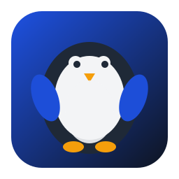

# Waddle Agent OS



**Waddle Agent OS** é uma plataforma local para coordenar agentes de IA em uma interface visual. O projeto combina um frontend web em React, uma API em FastAPI, persistência em SQLite e motores locais/CLI como Ollama, Codex e Claude Code.

O objetivo é oferecer uma experiência parecida com um painel de trabalho multiagente: a Quinta coordena a conversa, agentes especialistas contribuem com opiniões ou tarefas, e o usuário acompanha tudo pela interface.

---

## Principais recursos

| Área | Status | Descrição |
| --- | --- | --- |
| Interface visual | [OK] | UI web com painel de conversa, agentes, histórico, tarefas e modo desenvolvedor. |
| Multiagentes | [OK] | Quinta coordena Atlas, Nero e Iris em rodadas locais de discussão. |
| Ollama local | [OK] | Respostas locais com modelo leve, sem exigir API key. |
| OpenAI/Codex API | [OK] | Nero pode responder pela Responses API quando `OPENAI_API_KEY` estiver configurada. |
| Claude API | [OK] | Iris pode responder pela Messages API quando `ANTHROPIC_API_KEY` estiver configurada. |
| Codex CLI / Claude Code | [OK] | CLIs detectadas para fluxos locais de implementação/revisão. |
| Histórico | [OK] | Mensagens, eventos, tarefas, artefatos e rotinas persistidos em SQLite. |
| WebSocket | [OK] | Eventos da equipe transmitidos em tempo real para a interface. |
| Kill switch | [OK] | Controle para interromper execuções ativas com segurança. |

---

## Agentes padrão

| Agente | Função | Motor padrão | Papel no sistema |
| --- | --- | --- | --- |
| **Quinta** | Manager | Ollama | Coordena a equipe, consolida respostas e decide o próximo passo. |
| **Atlas** | Research | Ollama | Analisa contexto local, levanta caminhos e organiza descobertas. |
| **Nero** | Developer | Codex/OpenAI | Responsável por implementação e mudanças testáveis no código. |
| **Iris** | Reviewer | Claude | Foca em revisão, qualidade, riscos e validação. |

Quando não há autenticação/API key disponível para OpenAI/Codex ou Claude, o Waddle mantém esses agentes na conversa com respostas seguras de fallback. Assim o fluxo continua funcionando localmente com Ollama.

---

## Mascote e ícones

O projeto usa o Waddle, um pinguim minimalista inspirado em bots assistivos modernos. Os SVGs ficam em `assets/` e também em `web/public/`.

| Estado | Ícone |
| --- | --- |
| Padrão |  |
| Digitando |  |
| Pensando |  |
| Sucesso |  |
| Erro |  |
| Piscando |  |
| Caminhada 1 |  |
| Caminhada 2 |  |
| Caminhada 3 |  |

---

## Arquitetura

```text
Frontend React/Vite
        │
        ├── REST API: status, agentes, tarefas, histórico, rotinas e motores
        │
        └── WebSocket: eventos em tempo real
                │
FastAPI backend ─┬── AgentRuntime
                 ├── EventBus
                 ├── TaskManager
                 ├── ToolRegistry
                 ├── ProviderRegistry
                 ├── LLMProviderClient
                 └── SQLite
                        │
                        ├── Ollama local
                        ├── OpenAI Responses API
                        ├── Claude Messages API
                        ├── Codex CLI
                        └── Claude Code CLI
```

### Componentes principais

| Caminho | Responsabilidade |
| --- | --- |
| `src/waddle/api/server.py` | API FastAPI e WebSocket de eventos. |
| `src/waddle/runtime/agent_runtime.py` | Registro de agentes, execução de objetivos e rotinas. |
| `src/waddle/agents/manager.py` | Lógica da Quinta, discussão multiagente e roteamento por provedor. |
| `src/waddle/llm/provider_client.py` | Cliente unificado para Ollama, OpenAI/Codex e Claude nas conversas dos agentes. |
| `src/waddle/providers.py` | Detecção de Ollama, Codex CLI e Claude Code. |
| `src/waddle/storage/database.py` | Persistência SQLite de agentes, mensagens, tarefas, rotinas e artefatos. |
| `web/src/App.tsx` | Estado principal da interface web. |
| `web/src/components/DeveloperDrawer.tsx` | Modo desenvolvedor com tarefas, ferramentas, motores e eventos. |
| `web/src/components/AgentProfileDialog.tsx` | Edição de perfil e motor preferido de agentes customizados. |
| `web/src/components/WaddleAvatar.tsx` | Mascote SVG animado na interface. |

---

## Requisitos

- Python 3.9+
- Node.js compatível com Vite 5
- Ollama instalado para respostas locais
- Opcional: `OPENAI_API_KEY` para respostas via OpenAI/Codex API
- Opcional: `ANTHROPIC_API_KEY` para respostas via Claude API
- Opcional: Codex CLI autenticado para automação local de código
- Opcional: Claude Code autenticado para revisão/arquitetura no terminal

Dependências Python principais:

- FastAPI
- Uvicorn
- Pydantic
- WebSockets
- PySide6 para o shell nativo legado

Dependências web principais:

- React
- TypeScript
- Vite

---

## Como executar em desenvolvimento

### 1. Backend

```powershell
python -m venv .venv
.\.venv\Scripts\Activate.ps1
pip install -r requirements.txt

python -m uvicorn --app-dir src waddle.api.server:app --host 127.0.0.1 --port 8000
```

API local:

```text
http://127.0.0.1:8000
```

### 2. Frontend

```powershell
cd web
npm install
npm run dev
```

Interface local:

```text
http://127.0.0.1:5173
```

### 3. Ollama

```powershell
ollama serve
ollama pull qwen2.5:0.5b
```

O backend consulta o Ollama em:

```text
http://127.0.0.1:11434
```

### 4. APIs opcionais: OpenAI/Codex e Claude

Copie `.env.example` para `.env` e preencha apenas as chaves que quiser usar:

```powershell
Copy-Item .env.example .env
```

```env
OPENAI_API_KEY=
OPENAI_MODEL=gpt-4o

ANTHROPIC_API_KEY=
ANTHROPIC_MODEL=claude-sonnet-5
```

Essas chaves nunca devem ser commitadas. Se ficarem vazias, Nero e Iris continuam aparecendo na rodada multiagente com fallback seguro, enquanto Atlas/Quinta podem responder localmente pelo Ollama.

### Como os agentes conversam

O fluxo atual é coordenado pela Quinta:

1. o usuário envia uma mensagem para `/api/objectives`;
2. a Quinta seleciona os agentes relevantes;
3. cada agente recebe o mesmo objetivo contextualizado pelo seu papel;
4. `LLMProviderClient` chama o motor configurado daquele agente;
5. cada resposta vira uma mensagem `discussion` no `EventBus` e é salva no SQLite;
6. a Quinta consolida as opiniões em uma resposta final.

Esse desenho evita um “chat infinito” entre bots: as rodadas têm participantes definidos, fallback quando um provedor não está configurado e limite de resposta por chamada. Para um modo mais avançado de todos conversarem entre si, o próximo passo é adicionar rodadas controladas de crítica entre agentes com limite de turnos, memória por conversa e uma regra clara de parada.

---

## API principal

| Método | Rota | Uso |
| --- | --- | --- |
| `GET` | `/api/status` | Estado geral do runtime. |
| `GET` | `/api/agents` | Lista agentes registrados. |
| `POST` | `/api/agents` | Cria agente customizado. |
| `PATCH` | `/api/agents/{agent_name}` | Atualiza perfil de agente customizado. |
| `GET` | `/api/tasks` | Lista tarefas. |
| `GET` | `/api/tools` | Lista ferramentas disponíveis. |
| `GET` | `/api/providers` | Lista motores detectados: Ollama, Codex e Claude. |
| `GET` | `/api/history` | Retorna mensagens, eventos, tarefas, artefatos e rotinas. |
| `GET` | `/api/agents/{agent_name}/history` | Histórico filtrado por agente. |
| `POST` | `/api/objectives` | Envia objetivo ou mensagem para um agente. |
| `POST` | `/api/routines` | Cria rotina local associada a um agente. |
| `POST` | `/api/kill-switch` | Interrompe tarefas ativas. |
| `WS` | `/ws/events` | Stream de eventos em tempo real. |

Exemplo de envio de objetivo:

```powershell
$body = @{
  objective = "Faça uma rodada curta sobre como melhorar o projeto sem API keys"
  agent_name = "Quinta"
} | ConvertTo-Json

Invoke-RestMethod `
  -Uri "http://127.0.0.1:8000/api/objectives" `
  -Method Post `
  -ContentType "application/json" `
  -Body $body
```

---

## Testes e build

Rodar testes Python:

```powershell
$env:PYTHONPATH = "src"
python -m unittest discover -s tests -p "test_*.py"
```

Build do frontend:

```powershell
cd web
npm run build
```

---

## Estrutura do projeto

```text
assets/                    # Mascote e ícones SVG
docs/                      # Planos e documentação de evolução
scripts/                   # Scripts auxiliares
src/
├── cli_harness/            # Shell nativo legado em PySide6/QML
└── waddle/
    ├── agents/             # Agentes base, manager e workers
    ├── api/                # Backend FastAPI
    ├── core/               # EventBus e camada de sistema
    ├── runtime/            # Runtime multiagente
    ├── storage/            # SQLite e histórico
    ├── tasks/              # Modelo e gerenciador de tarefas
    ├── tools/              # Registro e execução de ferramentas
    └── providers.py        # Detecção de motores locais/CLI
tests/                     # Testes de runtime, API interna, providers e segurança
web/
├── public/                 # Ícones usados pelo frontend
└── src/                    # Interface React/Vite
```

---

## Modo desenvolvedor

A interface possui um painel de desenvolvimento com:

- tarefas ativas e recentes;
- ferramentas registradas;
- motores detectados e seus status;
- stream de eventos do runtime.

Os motores aparecem como:

- **pronto**: instalado e respondendo;
- **instalado**: encontrado, mas sem serviço/sessão ativa;
- **faltando**: não detectado no ambiente local.

---

## Roadmap

- Execução real de tarefas pelo Codex CLI dentro do fluxo Nero.
- Revisões estruturadas com Claude Code dentro do fluxo Iris.
- Rodadas multiagente com crítica entre pares e limite de turnos.
- Seleção avançada de modelo Ollama por agente.
- Criação e execução automática de rotinas.
- Melhor empacotamento desktop para Windows/Linux.
- Mais testes de integração para WebSocket, providers e fluxo visual.

---

## Licença

Este repositório ainda não declara uma licença formal. Antes de distribuir ou reutilizar o código em outro contexto, adicione um arquivo `LICENSE` apropriado ao objetivo do projeto.
